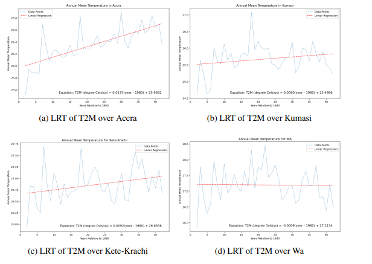

<https://github.com/kirilltobola/r-project>

## Прогностический анализ

*Цель: Использовать текущие и исторические данные, чтобы делать прогнозы относительно будущих данных.*

### Исследование

**"Global Warming In Ghana's Major Cities Based on Statistical Analysis of NASA's POWER Over 3-Decades"** [@test]

<https://arxiv.org/abs/2308.10909>

### Доказательство

1.  Исследование направлено на анализ климата в крупных городах Ганы. В результате была разработана модель для построения прогноза климатических данных (температура и т.п.) для выбранного региона (государство Гана).
2.  Используются климатические данные NASA для выбранного региона за период 1982 - 2022.
3.  На основе данных разработана регрессионная модель, с помощью которой сделаны предсказания климатических данных за 2023 год.

### Картинки

### Мат. формулы

$T2M = 0.0175 * (year - 1980) + 25.0682$

$B(LST) = \frac{L_{sen} - L_{up} - \tau * (1 - \epsilon) * \frac{L_{down}}{\pi}}{\tau * \epsilon}$

### Таблицы

| Source     | df   | sum_sq | mean_sq | f     |
|------------|------|--------|---------|-------|
| Regression | 1.0  | 1.75   | 1.7562  | 44.22 |
| Residual   | 39.0 | 1.54   | 0.03    | NaN   |
|            |      |        |         |       |

## Дедуктивный анализ

*Цель: Используется небольшая выборка данных, чтобы сделать вывод о генеральной совокупности в целом*

### Исследование

**"Состояние здоровья учащихся медицинских и фармацевтических колледжей России"**

<https://cyberleninka.ru/article/n/sostoyanie-zdorovya-uchaschihsya-meditsinskih-i-farmatsevticheskih-kolledzhey-rossii/viewer>

### Доказательство

-   В исследовании были опрошены 180 тысяч студентов медицинских колледжей.
-   В работе были проанализированы состояния здоровья выборки студентов, а также предложены варианты решения описанных проблем для генеральной совокупности (всех студентов медицинских колледжей России).

------------------------------------------------------------------------
